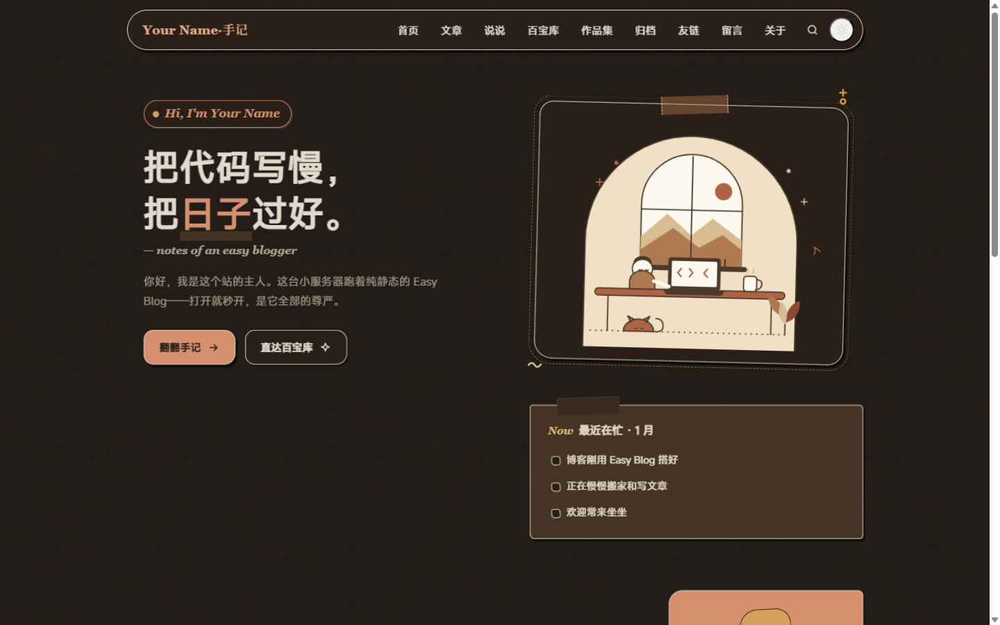
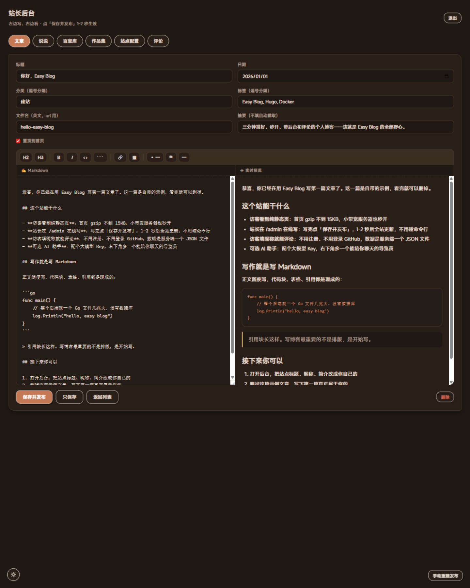

<div align="center">


# Easy Blog

**手作贴纸风格的轻量博客系统 —— Hugo 纯静态前台 + Go 单二进制后端**

访客看到秒开的静态页，站长在浏览器里写文章、保存即发布。

[快速开始](#-快速开始) · [English](#-english)

   

</div>


## ✨ 特性

- **🪶 快得离谱** — 全站纯静态，首页 gzip 不到 15KB；2 核 2G 小服务器毫无压力
- **✍️ 在线写作** — `/admin` 后台写 Markdown，保存后服务器自动 Hugo 构建并原子发布，1-2 秒生效
- **💬 内置评论** — 访客填昵称就能留言，JSON 文件存储零数据库，前端 textContent 渲染防 XSS
- **🧩 内容形态丰富** — 文章 / 说说 / 百宝库（好物推荐）/ 作品集（访客可点赞）/ 留言板 / 友链
- **🤖 AI 助手（可选）** — OpenAI 兼容 / Anthropic 双协议，智谱 GLM、DeepSeek、Kimi、Ollama 都能接
- **🌓 双主题** — 暖陶土配色 + 深色模式跟随系统，手绘贴纸质感
- **🔍 SEO 就绪** — canonical、Open Graph、结构化数据、sitemap、RSS 全内置
- **🔒 安全内置** — 登录限流、HMAC 会话、编辑路径白名单、蜜罐防机器人、AI 限流

## 🚀 快速开始

需要一台装了 Docker 的机器（1 核 1G 都够），三条命令：

```bash
git clone https://github.com/FortC/Easy-Blog.git
cd Easy-Blog

cp .env.example .env        # 编辑它：把 ADMIN_PASSWORD 换成你的长密码

docker compose up -d --build
```

打开 `http://服务器IP:8080/` 看到博客，`http://服务器IP:8080/admin` 进后台开写。

<p align="center">
  
  
  <br>
  <sub>左：贴纸风前台 · 右：在线写作后台</sub>
</p>

## 🔧 部署后要做的 5 件事

1. **改站点信息** — 后台「站点配置」里改标题、昵称、简介、邮箱（就是 hugo.yaml 的 `params`）
2. **删示例内容** — 后台删掉自带的欢迎文章和示例说说，写你自己的
3. **有域名就绑** — `hugo.yaml` 的 `baseURL` 改成域名，compose 端口 8080 换 80，前置 nginx/caddy 加 HTTPS
4. **想开 AI 助手** — 见下面一节
5. **备份** — 所有数据（文章/评论/配置）都在 `easyblog-data` 卷里，见下下节

## 🤖 AI 助手（可选）

`.env` 里配任意一家模型服务商，然后把 `hugo.yaml` 的 `params.ai.enabled` 改成 `true`（或后台改），`docker compose up -d` 重启：

```ini
# OpenAI / 智谱 GLM / DeepSeek / Kimi / Qwen 等所有 OpenAI 兼容接口
AI_PROVIDER=openai
AI_BASE_URL=https://open.bigmodel.cn/api/paas/v4
AI_MODEL=glm-4-flash
AI_API_KEY=你的key

# 或者 Anthropic
# AI_PROVIDER=anthropic
# AI_BASE_URL=https://api.anthropic.com
# AI_MODEL=claude-sonnet-4-5
# AI_API_KEY=sk-ant-xxxx
```

Key 只存在服务器端，前端拿不到；内置每 IP 每分钟 10 次限流和上下文截断。

## 📦 数据与备份

你的全部数据在 Docker 卷 `easyblog-data`（容器内 `/data`）：

```
/data
├── content/      # 全部文章、说说、百宝库（Markdown）
├── data/         # 友链
├── hugo.yaml     # 站点配置（后台改的就是它）
└── serverdata/   # 评论、点赞数据（JSON）
```

```bash
docker compose exec easyblog tar czf - -C /data . > easyblog-backup.tar.gz   # 备份
docker run --rm -v easyblog-data:/data -v $PWD:/in alpine tar xzf /in/easyblog-backup.tar.gz -C /data   # 恢复
```

升级版本：`git pull && docker compose up -d --build`。你的内容在卷里不会丢；主题文件（layouts/assets/static）会随镜像更新。

## 🖥 裸机部署（可选）

不想用 Docker？`deploy/` 里有全套：systemd 服务、nginx 配置、环境变量模板、同步脚本。

```bash
cd server && GOOS=linux GOARCH=amd64 go build -ldflags="-s -w" -o easyblog-server-linux-amd64 .
# 服务器上装 hugo（后台发布依赖）+ easyblog-server + systemd 服务
# 详细步骤见 deploy/easyblog-server.service 和 deploy/nginx-easyblog.conf 里的注释
```

## 🛠 本地开发

```bash
# 终端 1：后端（改端口/密码随意）
cd server && go build -o easyblog-server .
ADMIN_PASSWORD=test123 SITE_ROOT=.. HUGO_BIN=hugo ./easyblog-server

# 终端 2：前台静态 + API 转发（8643 → 8788）
python tools/devserver.py

# 访问 http://127.0.0.1:8643/（前台）和 http://127.0.0.1:8788/admin（后台）
# 想让 AI 助手说话：python tools/mock-ai.py 起演示上游
```

改完模板跑一次 `hugo --minify` 确认构建通过。设计规范见 [AGENTS.md](AGENTS.md)。

## 📊 性能账本

| 项 | 数据 |
|----|------|
| 首页 gzip | ~6KB，3-4 个请求 |
| 评论/AI 对页面性能的影响 | 0（评论区滚动到才加载；AI 点击才加载脚本） |
| 后端内存 | 闲置 ~15MB，构建瞬时 <128M |
| 镜像 | Debian slim + Hugo + Go 后端 |

## 📁 目录结构

```
Easy-Blog/
├── hugo.yaml               # 站点配置（★ 部署后后台可在线改）
├── content/                # 内容：posts 文章 / sayings 说说 / treasure 百宝库 / works 作品
├── data/links.yaml         # 友链（后台可编辑）
├── layouts/                # 「手作贴纸」主题模板
├── assets/css/main.css     # 全部样式（暖陶土双主题）
├── static/                 # 字体/插画/AI 前端
├── server/                 # easyblog-server：Go 单二进制后端（纯标准库）
│   ├── main.go / auth.go / comments.go / content.go / siteconfig.go / aiproxy.go / static.go
│   └── admin/index.html    # 站长后台（embed 进二进制）
├── docker/entrypoint.sh    # 容器入口：首次初始化 + 主题同步 + 首次构建
├── deploy/                 # 裸机部署：systemd / nginx / 环境变量模板
└── tools/                  # 本地开发小工具
```

## 📄 License

[Apache-2.0](LICENSE) — 字体 Fraunces 遵循 [SIL OFL](https://openfontlicense.org/)。

---

# 🇬🇧 English

<div align="center">

**A lightweight blog with a handcrafted paper-sticker aesthetic — a pure-static Hugo frontend plus a single Go binary backend.**

Visitors get pages that load instantly; you write posts in the browser and hit publish.

</div>

## ✨ Features

- **🪶 Absurdly fast** — fully static pages, homepage under 15KB gzipped; happy on a 1-core 1GB VPS
- **✍️ Write online** — draft Markdown in the `/admin` panel; saving triggers a Hugo rebuild with atomic publish in 1-2s
- **💬 Built-in comments** — nickname only, no accounts; JSON-file storage, zero database; XSS-safe textContent rendering
- **🧩 Rich content types** — posts / short notes / treasure box (recommendations) / works (visitors can upvote) / guestbook / blogroll
- **🤖 AI assistant (optional)** — dual protocol (OpenAI-compatible / Anthropic); works with GLM, DeepSeek, Kimi, Qwen, Ollama…
- **🌓 Dual themes** — warm terracotta palette, dark mode follows the system, hand-drawn sticker textures
- **🔍 SEO ready** — canonical, Open Graph, structured data, sitemap, RSS out of the box
- **🔒 Secure by default** — login rate-limiting, HMAC sessions, path whitelist for edits, honeypot, AI rate-limiting

## 🚀 Quick Start

Any machine running Docker (1 core / 1GB is enough):

```bash
git clone https://github.com/FortC/Easy-Blog.git
cd Easy-Blog

cp .env.example .env        # edit it: set ADMIN_PASSWORD to a long secret

docker compose up -d --build
```

Open `http://your-server-ip:8080/` for the blog, and `http://your-server-ip:8080/admin` to start writing.

## 🔧 After Deploying

1. **Site info** — change title / author / intro in the admin panel (it edits `hugo.yaml` for you)
2. **Sample content** — delete the demo posts and notes, write your own
3. **Domain** — set `baseURL` in `hugo.yaml`, map port 80, put nginx/caddy in front for HTTPS
4. **AI assistant** — set `AI_*` vars in `.env`, flip `params.ai.enabled` to `true`, restart
5. **Backups** — everything lives in the `easyblog-data` volume:

```bash
docker compose exec easyblog tar czf - -C /data . > easyblog-backup.tar.gz   # backup
docker run --rm -v easyblog-data:/data -v $PWD:/in alpine tar xzf /in/easyblog-backup.tar.gz -C /data   # restore
```

Upgrading: `git pull && docker compose up -d --build`. Your content stays in the volume; theme files refresh with the image.

## 🤖 AI Assistant (optional)

Any OpenAI-compatible endpoint or Anthropic. Keys stay server-side; rate-limited per IP.

```ini
AI_PROVIDER=openai
AI_BASE_URL=https://open.bigmodel.cn/api/paas/v4
AI_MODEL=glm-4-flash
AI_API_KEY=your-key
```

## 🖥 Bare Metal (optional)

Prefer systemd over Docker? `deploy/` ships a service unit, an nginx config, an env template, and sync scripts. Build the binary with:

```bash
cd server && GOOS=linux GOARCH=amd64 go build -ldflags="-s -w" -o easyblog-server-linux-amd64 .
```

## 🛠 Development

```bash
cd server && go build -o easyblog-server .
ADMIN_PASSWORD=test123 SITE_ROOT=.. ./easyblog-server          # backend on :8788
python tools/devserver.py                                       # frontend + API proxy on :8643
```

Run `hugo --minify` after touching templates. Design rules live in [AGENTS.md](AGENTS.md).

## 📊 Performance Ledger

| Item | Number |
|------|--------|
| Homepage (gzipped) | ~6KB, 3-4 requests |
| Impact of comments/AI on page load | 0 (lazy on scroll / on click) |
| Backend memory | ~15MB idle, <128M during builds |

## 📄 License

[Apache-2.0](LICENSE) — the Fraunces font is under [SIL OFL](https://openfontlicense.org/).
